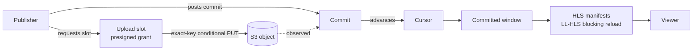

# Open Live Object Streaming (OLOS)

[](https://socket.dev/npm/package/@arsenstorm/olos)
[](https://scorecard.dev/viewer/?uri=github.com/arsenstorm/olos)

OLOS is for live adaptive media in which encoded media is published as
immutable, time-indexed CMAF objects and exposed through standard or native
low-latency playback interfaces. Media bytes land on any S3-compatible object
store (S3, R2, GCS-S3, MinIO) as exact-key uploads; a coordinator turns those
uploads into stream state; viewers play the result over LL-HLS with blocking
reload. The wire version is `1.0` and the specification is currently in
draft — the reference implementation is the npm package
[`@arsenstorm/olos`](./olos/README.md).

## How it flows



> **Core invariant:** an object existing is not the same as an object being
> part of stream state. An uploaded object contributes nothing until its
> commit is accepted and the cursor advances; only the committed window is
> rendered into manifests. The manifest is the gate.

## Quick start

A complete OLOS endpoint with S3-backed live media:

```ts
import {
  createMemorySerializedCoordinatorStoreBackend,
  createSerializedCoordinatorStore,
} from "@arsenstorm/olos/protocol";
import { createStoredS3CoordinatorRuntimeHandler } from "@arsenstorm/olos/s3";
import { S3Client } from "@aws-sdk/client-s3";

const handleOlos = createStoredS3CoordinatorRuntimeHandler({
  allowedMediaOrigins: ["https://media.example.com"],
  bucket: "olos-media",
  client: new S3Client({ region: "us-east-1" }),
  expiresInSeconds: 5,
  providerId: "s3_primary",
  store: createSerializedCoordinatorStore(
    createMemorySerializedCoordinatorStoreBackend()
  ),
});

export default { fetch: (req: Request) => handleOlos(req) };
```

Publishers create a session, then loop: get a presigned slot, PUT media bytes
to S3, post a commit. Viewers GET HLS manifests. The handler covers it. See
[`olos/README.md`](./olos/README.md) for the full API, the mounted routes,
and the subpath export table (`@arsenstorm/olos/runtime`, `/s3`, `/hls`,
`/protocol`, `/state`, `/schema`, `/validation`, `/types`, `/config`,
`/conformance`).

## Layers at a glance

- **Core** — slots, observations, commits, cursors, the committed window.
  Media-agnostic; no HLS, no S3, no HTTP.
- **LL-HLS profile** — renders the committed window into a playable LL-HLS
  manifest with blocking reload.
- **S3-compatible binding** — the minimum a storage backend must provide:
  exact-key uploads, conditional create, `HeadObject` consistency, optional
  event notifications.
- **Direct-public deployment profile** — committed media bytes served
  directly from the media origin, with the manifest as the gate.
- **Runtime guidance** — heartbeats, retention, reconciliation, live health,
  publisher loops.

## Repository map

| Path | What it is |
| --- | --- |
| [`olos/`](./olos/README.md) | The `@arsenstorm/olos` package: protocol primitives, runtime handler, API docs, and subpath export table. |
| [`spec/`](./spec/README.md) | The OLOS protocol specification: normative wire format, state machine, HLS mapping, and conformance mapping. |
| [`examples/api`](./examples/api/README.md) | Cloudflare Worker mounting the OLOS S3 runtime handler over a Durable Object coordinator store; MinIO locally, R2 in production. |
| [`examples/streamer`](./examples/streamer/README.md) | OBS → RTMP → ffmpeg → LL-HLS → OLOS bridge publishing micro-segments as byterange parts and assembled segments. |
| [`examples/player`](./examples/player/README.md) | Minimal browser player using hls.js with LL-HLS enabled against the `examples/api` Worker. |
| [`benchmarks/`](./benchmarks/README.md) | Glass-to-glass latency harness: barcode-in-frame timestamps through a local, loopback-only OLOS stack. |
| [`CONTRIBUTING.md`](./CONTRIBUTING.md) | How to set up, test, and submit changes. |
| [`olos/CHANGELOG.md`](./olos/CHANGELOG.md) | Package changelog (the root `CHANGELOG.md` is a pointer to it). |

## Status

- **Wire version:** `1.0` — the `olos` field carried by every session.
- **Specification:** [`spec/`](./spec/README.md), status `draft-v1.0.0`.
  The spec is mapped section-by-section to the package's conformance
  assertions (`@arsenstorm/olos/conformance`); the JSON Schemas
  (`@arsenstorm/olos/schema`) are reproduced in its generated appendix.
- **Package:** [`@arsenstorm/olos`](https://www.npmjs.com/package/@arsenstorm/olos),
  released with Changesets; see [`olos/CHANGELOG.md`](./olos/CHANGELOG.md).

## Development

The repository is a Bun workspace (`olos`, `examples/*`, `benchmarks`).

```bash
bun install        # install all workspaces
bun run build      # build the @arsenstorm/olos package into olos/dist/
bun run test       # unit tests
bun run check      # Ultracite/Biome lint + format check
bun run check-types # typecheck every workspace against the built package
```

See [`CONTRIBUTING.md`](./CONTRIBUTING.md) for the full workflow, and add a
changeset (`bun changeset`) for any user-visible package change.

## License

OLOS is licensed under the MIT License. See the [LICENSE](LICENSE) file for details.

<sub>Copyright © 2026 Arsen Shkrumelyak. All rights reserved.</sub>
