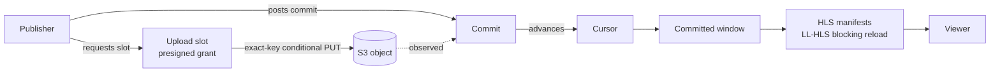

# Open Live Object Streaming (OLOS)

[](https://socket.dev/npm/package/@arsenstorm/olos)
[](https://scorecard.dev/viewer/?uri=github.com/arsenstorm/olos)

OLOS is a protocol for live adaptive media. Publishers upload encoded media
as immutable, time-indexed CMAF objects. The objects land on an
S3-compatible object store (S3, R2, GCS-S3, MinIO) as exact-key uploads. A
coordinator turns the uploads into stream state. Viewers play the stream
over LL-HLS with blocking reload.

The npm package [`@arsenstorm/olos`](./olos/README.md) is the reference
implementation. The [specification](./spec/README.md) is a draft.

## How it works



An object in storage is not part of the stream. It becomes part of the
stream only after the coordinator accepts its commit and the cursor
advances. Manifests render only the committed window.

## Install

```bash
npm install @arsenstorm/olos @aws-sdk/client-s3
```

## Quick start

A complete OLOS endpoint with S3-backed live media:

```ts
import {
  createMemorySerializedCoordinatorStoreBackend,
  createSerializedCoordinatorStore,
} from "@arsenstorm/olos/protocol";
import { createStoredS3CoordinatorRuntimeHandler } from "@arsenstorm/olos/s3";
import { S3Client } from "@aws-sdk/client-s3";

const handleOlos = createStoredS3CoordinatorRuntimeHandler({
  allowedMediaOrigins: ["https://media.example.com"],
  bucket: "olos-media",
  client: new S3Client({ region: "us-east-1" }),
  expiresInSeconds: 5,
  providerId: "s3_primary",
  store: createSerializedCoordinatorStore(
    createMemorySerializedCoordinatorStoreBackend()
  ),
});

export default { fetch: (req: Request) => handleOlos(req) };
```

The handler serves every route. A publisher creates a session, then repeats
three steps:

1. Get a presigned upload slot.
2. PUT the media bytes to S3.
3. Post a commit.

Viewers GET the HLS manifests. See [`olos/README.md`](./olos/README.md) for
the full API, the mounted routes, and the subpath exports.

## Layers

- **Core**: slots, observations, commits, cursors, and the committed window.
  The core has no HLS, S3, or HTTP concepts.
- **LL-HLS profile**: renders the committed window into an LL-HLS manifest
  with blocking reload.
- **S3-compatible binding**: what a storage backend must provide. This is
  exact-key uploads, conditional create, `HeadObject` consistency, and
  optional event notifications.
- **Direct-public deployment profile**: the media origin serves committed
  media bytes directly, and the manifest controls what is visible.
- **Runtime guidance**: heartbeats, retention, reconciliation, live health,
  and publisher loops.

## Repository map

| Path | What it is |
| --- | --- |
| [`olos/`](./olos/README.md) | The `@arsenstorm/olos` package: protocol primitives, runtime handler, API docs, and subpath export table. |
| [`spec/`](./spec/README.md) | The OLOS protocol specification: normative wire format, state machine, HLS mapping, and conformance mapping. |
| [`examples/api`](./examples/api/README.md) | Cloudflare Worker that mounts the OLOS S3 runtime handler over a Durable Object coordinator store. Uses MinIO locally and R2 in production. |
| [`examples/streamer`](./examples/streamer/README.md) | OBS → RTMP → ffmpeg → LL-HLS → OLOS bridge. Publishes micro-segments as byterange parts and assembled segments. |
| [`examples/player`](./examples/player/README.md) | Minimal browser player. Uses hls.js with LL-HLS enabled against the `examples/api` Worker. |
| [`benchmarks/`](./benchmarks/README.md) | Glass-to-glass latency harness: barcode-in-frame timestamps through a local, loopback-only OLOS stack. |
| [`CONTRIBUTING.md`](./CONTRIBUTING.md) | How to set up, test, and submit changes. |
| [`olos/CHANGELOG.md`](./olos/CHANGELOG.md) | Package changelog (the root `CHANGELOG.md` is a pointer to it). |

## Status

- **Wire version:** `1.0`. Every session carries this value in its `olos`
  field.
- **Specification:** `draft-v1.0.0`. Each spec section maps to conformance
  assertions in `@arsenstorm/olos/conformance`.
- **Package:** [`@arsenstorm/olos`](https://www.npmjs.com/package/@arsenstorm/olos)
  on npm, released with Changesets.

## Development

The repository is a Bun workspace (`olos`, `examples/*`, `benchmarks`).

```bash
bun install        # install all workspaces
bun run build      # build the @arsenstorm/olos package into olos/dist/
bun run test       # unit tests
bun run check      # Ultracite/Biome lint + format check
bun run check-types # typecheck every workspace against the built package
```

If a change is visible to package users, add a changeset with
`bun changeset`. See [`CONTRIBUTING.md`](./CONTRIBUTING.md) for the full
workflow.

## License

MIT. See [LICENSE](LICENSE).

<sub>Copyright © 2026 Arsen Shkrumelyak. All rights reserved.</sub>
